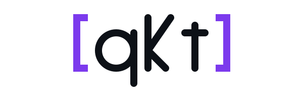
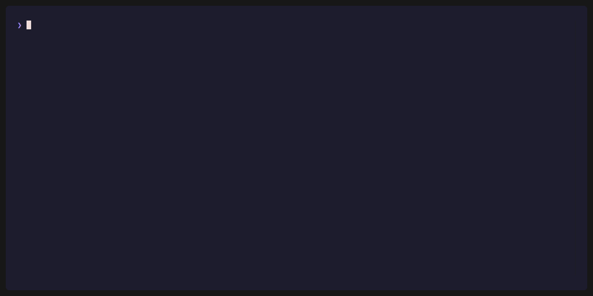

<p align="center">
  
</p>

<h3 align="center">Write trading strategies in a SQL-like language.<br/>Backtest them deterministically — then run the same code live.</h3>

<p align="center">
  <a href="https://github.com/elitekaycy/qkt/actions/workflows/check.yml"></a>
  <a href="https://github.com/elitekaycy/qkt/actions/workflows/docs.yml"></a>
  <a href="https://github.com/elitekaycy/qkt/releases/latest"></a>
  <a href="LICENSE"></a>
</p>

<p align="center">
  <a href="https://elitekaycy.github.io/qkt/"></a>
  <a href="QUICKSTART.md"></a>
  <a href="#install"></a>
</p>

<p align="center">
  <sub><a href="docs/phases/">What's inside</a> · <a href="docs/parity/backtest-vs-live.md">Backtest↔live parity</a> · <a href="docs/research/index.md">Research workflow</a></sub>
</p>

<p align="center">
  
</p>

---

**qkt** is an event-driven trading engine in Kotlin. You describe a strategy in a small, readable DSL — symbols, indicators, and `WHEN … THEN …` rules — and qkt compiles it into a runnable strategy. The same compiled strategy and engine pipeline run in backtest and live modes. Determinism is pinned for identical inputs at the shared pipeline and paper-broker boundary; venue execution and operational effects remain explicit divergences in the [backtest/live parity register](docs/parity/backtest-vs-live.md).

```haskell


STRATEGY gold_multi_tf VERSION 1


DEFAULTS { SIZING = 0.10 }


SYMBOLS
  gold_m15 = BACKTEST:XAUUSD EVERY 15m WARMUP 100 BARS
  gold_h1  = BACKTEST:XAUUSD EVERY 1h WARMUP 100 BARS
  gold_h4  = BACKTEST:XAUUSD EVERY 4h WARMUP 100 BARS
  gold_d1  = BACKTEST:XAUUSD EVERY 1d WARMUP 100 BARS


RULES
  WHEN ema(gold_h4.close, 50) > ema(gold_h4.close, 200)
   AND rsi(gold_h1.close, 14) < 30
   AND gold_m15.close > vwap(gold_m15.tick, 1000)
   AND percentile_rank(atr(gold_h1.candle, 14), 200) < 0.5
   AND POSITION.gold_m15 = 0

  THEN BUY gold_m15
       BRACKET { STOP LOSS BY 2.0, TAKE PROFIT BY 4.0 }


```

```bash
qkt parse gold_multi_tf.qkt                                  # compile-check; prints ok or line:col errors
qkt backtest gold_multi_tf.qkt --from 2024-01-01 --to 2024-04-01   # replay history, emits report.html
qkt run gold_multi_tf.qkt                                    # paper-trade it live in the foreground
```

That's a complete strategy: a 4h trend filter, a 1h RSI dip, a 15m VWAP trigger, and a volatility-regime gate via `percentile_rank` — one position at a time with an attached stop-loss and take-profit bracket. The same file runs against historical data, on a paper broker, or against a real venue — you change the data source, not the strategy. (`vwap` needs a volume-bearing feed; MT5 tick-count volume is refused — see the [indicator catalog](docs/reference/dsl/indicators.md).)

<br/>

## What you can trade

- **[CFDs](docs/instruments/cfds.md)** — FX, gold, indices and more via MT5 (`EXNESS`, `ICMarkets`, `FTMO`, `PEPPERSTONE`) through the `mt5-gateway`.
- **[Futures](docs/instruments/futures.md)** — listed contracts and continuous `@front`/`@next` streams: expiry-aware sizing, rolls carried or flattened, margin tracked daily, settlement booked at expiry. Live prices and execution arrive through a gateway account, so the strategy never talks to the venue directly.
- **[Options](docs/instruments/options.md)** — multi-leg structures (`OPEN … = OPTIONS ON …`) sized by quantity or % of equity at risk, triggered by `CHAIN:` implied-vol analytics (`atm_iv`, `skew_25d`). The chain a rule reads is the same chain the gateway recorded — backtest and live see identical snapshots.

Futures, perpetuals and options flow through **[qkt-venue-gateway](https://github.com/elitekaycy/qkt-venue-gateway)** — one container per account speaking the small VGP v1 protocol (auth · kill switch · idempotency · journal · reconciler), with adapters as plugins: a paper adapter on Deribit's live public prices (no venue account needed) and a Deribit testnet/mainnet adapter.

<p align="center">
  <a href="https://github.com/elitekaycy/qkt-venue-gateway"></a>
</p>

Spin one up (`docker compose up`, serves on `127.0.0.1:8443`), point qkt at it with a `type: gateway` broker entry, and the same `.qkt` file that backtested the structure trades it live.

## Why qkt

- **One language, backtest and live.** A `.qkt` strategy compiles to the same engine objects whether you're replaying history or trading a live account. No separate backtest dialect, no "it worked in the simulator."
- **Deterministic by construction.** Time, IDs, and randomness flow through injected interfaces (`Clock`, `IdGenerator`, seeds). Same inputs → same trades, every run. Backtest is a component swap, not a reimplementation.
- **A DSL that reads like intent.** Indicators (`ema`, `rsi`, `macd`, `atr`, `bollinger`, …), cross-stream rules, brackets, OCO, trailing stops, `STACK` pyramiding, `PORTFOLIO` composition, `SCHEDULE`, and `LOG` — all declared, not wired by hand.
- **Real brokers, real risk.** Live CFD execution on MT5 (multi-profile) through the `mt5-gateway`, and futures, perpetuals and options through [qkt-venue-gateway](https://github.com/elitekaycy/qkt-venue-gateway) (VGP v1 — Deribit paper + testnet/mainnet adapters) — all with reconciliation and reconnection. A risk engine tracks equity, drawdown, and daily loss, and halts as state with operator-driven resume.
- **Run one or run many.** `qkt run` foregrounds a single strategy; the `qkt daemon` hosts many in one JVM, each with its own log, observability port, and recovered-on-restart state.
- **Reports you can read.** Every backtest emits a self-contained `report.html` — equity and drawdown curves, Monte Carlo fan, per-trade risk, Sharpe / Calmar / profit factor.
- **Parity you can audit, costs you can reconcile.** One pipeline serves backtest and live — the same file, the same engine objects — and the [parity register](docs/parity/backtest-vs-live.md) names every explicit divergence. Fills carry spread, commission, swaps and roll costs (the MT5-fidelity simulator adds quantization and bid/ask), and every report reconciles gross-to-net from the same trade tape.
- **Editor support.** Syntax highlighting and snippets for `.qkt` in VS Code, Neovim/Vim, and any TextMate-based editor.

<sub>For the exhaustive, phase-by-phase feature list, see the collapsible section near the bottom or the <a href="docs/phases/">phase changelogs</a>.</sub>

## How qkt compares

Different tools optimize for different things. qkt's bet is a **declarative strategy language** where the *same file* you backtest is the file you run live.

| | **qkt** | Backtrader | vectorbt | NautilusTrader |
|---|:---:|:---:|:---:|:---:|
| Strategy definition | SQL-like DSL (`.qkt`) | Python subclass | Vectorized arrays | Python subclass |
| Same file backtest → live | ✅ one file | partial | research/backtest only | ✅ |
| Engine model | event-driven | event-driven | vectorized | event-driven |
| Deterministic by construction | ✅ injected clock/ids/seeds | — | n/a | ✅ |
| Live brokers | MT5 + Deribit via gateways | community adapters | — | multiple adapters |
| Runtime | Kotlin / JVM | Python | Python | Python + Rust |

If you want a full research SDK in Python, Nautilus and vectorbt are excellent. qkt trades that surface area for a small language that reads like the strategy in your head — and a hard guarantee that backtest and live are one pipeline, not two codebases.

## Install

The GitHub release is the canonical stable distribution. A versioned image such as
`ghcr.io/elitekaycy/qkt:v0.55.0` is built from the same tag; `:latest`, `:dev`, and
`:edge` are moving main, authoring, and testing channels rather than release pins.

### Docker (no local Java)

Two ready-made images, nothing to install.

**Try it out** — a self-contained workbench with an editor built in, so you can write, edit, and backtest strategies all in one place. Your work is saved in `~/qkt-lab` on your computer:

```bash
mkdir -p ~/qkt-lab
docker run -dit --name qkt-dev -v ~/qkt-lab:/work ghcr.io/elitekaycy/qkt:dev
docker exec -it qkt-dev bash          # qkt + vim ready; then: qkt create template mystrat.qkt
```

**Run it for real** — the lean image that hosts your strategies live:

```bash
docker run -d --name qkt \
  -v "$(pwd)/strategies:/strategies" \
  ghcr.io/elitekaycy/qkt:latest
docker exec qkt qkt list
```

Full walkthrough: [Using qkt with Docker](docs/operations/running-qkt-via-docker.md).

### Linux (x64) — self-contained binary, no Java required

Each release ships a bundled runtime, so qkt runs without a system JDK. Download `qkt-<version>-linux-x64.tar.gz` from the [latest release](https://github.com/elitekaycy/qkt/releases/latest), then:

```bash
tar xzf qkt-*-linux-x64.tar.gz
export PATH="$PWD/qkt/bin:$PATH"     # add ./qkt/bin to your PATH to call `qkt` from anywhere
qkt --version
```

### From source (any platform with JDK 21)

```bash
git clone https://github.com/elitekaycy/qkt.git && cd qkt
./gradlew installDist
./build/install/qkt/bin/qkt --version
```

### Windows

```powershell
# winget (recommended)
winget install elitekaycy.qkt

# or the one-line installer
irm https://raw.githubusercontent.com/elitekaycy/qkt/main/scripts/install.ps1 | iex
```

Both install a self-contained build (bundled Java runtime — no prerequisites). Open a new terminal, then `qkt --version`.

## A 60-second tour

```bash
# 1. Check it compiles
qkt parse gold_multi_tf.qkt

# 2. Backtest it against history
qkt backtest gold_multi_tf.qkt --from 2024-01-01 --to 2024-04-01

# 3. Or host it under the daemon
qkt daemon &                                      # background control plane on 127.0.0.1
qkt deploy gold_multi_tf.qkt --as gold_tf         # register + start, returns a port
qkt list                                          # NAME  UPTIME  PORT  TRADES  STATE
qkt logs gold_tf -f                               # tail this strategy's log
qkt stop gold_tf                                  # graceful shutdown
```

Each strategy gets its own `LiveSession`, observability HTTP port, and log file; strategies sharing a `(broker, symbol, timeframe)` share one candle aggregator. State survives a restart — in-flight orders and positions are recovered. Point the daemon at a folder with `qkt daemon --load-dir ./strategies` to auto-deploy every `.qkt` in it.

<br/>

For backtesting against real history (Dukascopy auto-fetch or your own CSV) and for going live on MT5 or through a venue gateway, follow the [Quickstart](QUICKSTART.md) and the [phase changelogs](docs/phases/).

## Editor support

`.qkt` files get syntax highlighting, snippets, and comment support. The fastest path:

```bash
qkt editor install nvim     # or: vscode, vim
```

This drops the right files into your editor's config. VS Code, Neovim/Vim, and TextMate grammars all live under [`editor/`](editor/) with per-editor install notes — see [editor integrations](docs/how-to/editor-integrations.md).

## Architecture

```
Tick → Engine → Strategy → Signal → Order → Broker → Trade
```

A single-threaded, event-driven pipeline. Every component is deterministic given its inputs and seeds. `Clock`, `IdGenerator`, and `SequenceGenerator` are interfaces, so backtest is a component swap rather than a rewrite. State shared between producers and consumers is exposed only through read-only interfaces — the type system enforces the read/write split. Strategies never touch brokers directly; everything flows through the bus.

Read the per-phase design specs in [`docs/superpowers/specs/`](docs/superpowers/specs/) for depth.

## Documentation

- **[Documentation site](https://elitekaycy.github.io/qkt/)** — quickstart, DSL grammar, CLI reference, deployment guides, architecture diagrams, and the Dokka API reference.
- [`docs/research/index.md`](docs/research/index.md) — end-to-end research workflow from strategy idea to governed promotion.
- [`docs/reference/config-schema.md`](docs/reference/config-schema.md) — complete `qkt.config.yaml` reference with examples for research, paper, production, qkt-forge, and portfolio workflows.
- [`docs/phases/`](docs/phases/) — per-phase changelogs, the authoritative "what's in qkt today" reference.
- [`QUICKSTART.md`](QUICKSTART.md) — a 5-minute getting-started.
- [`CONTRIBUTING.md`](CONTRIBUTING.md) · [`SECURITY.md`](SECURITY.md) · [`CODE_OF_CONDUCT.md`](CODE_OF_CONDUCT.md)

## Status

Pre-1.0 and under active development. Breaking changes can land in minor releases until `1.0.0`; the engine is functional and tested, but the public API isn't yet declared stable. See [`docs/release-process.md`](docs/release-process.md) for versioning.

<details>
<summary><b>The full feature list</b> (every phase)</summary>

- **Tick + candle pipeline** with a deterministic event bus.
- **Multi-strategy support** with per-strategy P&L attribution.
- **Risk engine** — equity tracking, drawdown halts, daily-loss halts, halt-as-state with operator-driven resume.
- **Backtest replay engine** with full reporting: equity curves, Sharpe, Calmar, profit factor, win/loss stats.
- **Parameter sweep harness** — sequential or fixed-pool parallel execution with ranked summaries.
- **Backtest HTML report** — self-contained `report.html` with SVG equity + drawdown charts, Monte Carlo fan, drawdown-period table, per-trade risk.
- **MT5 broker (multi-profile)** — per-broker `mt5-gateway` services; built-in defaults for Exness, ICMarkets, FTMO, Pepperstone; Market + Bracket + native pending entries, with client-managed OCO and trailing behavior.
- **Bybit Spot + Linear (USDT)** live trading with reconciliation, rate limiting, connection resilience.
- **TradingView live vendor** (anonymous, free-tier) for paper trading.
- **Multi-source market data** — one strategy can pull different streams from different vendors at once.
- **On-disk content-addressable data store** with Dukascopy auto-fetch and bring-your-own CSV.
- **STACK pyramiding** and **conditional bracketed stacks** (`STACK_AT`) — turn one `BUY`/`SELL` into N price-triggered entries with an optional time fence.
- **CANCEL action + PORTFOLIO** — cancel pending orders from inside a strategy; compose N strategies with regime-gated activation.
- **Portfolio daemon** — `qkt deploy mybook.qkt` fans out into per-child `LiveSession`s with their own ports and logs.
- **DSL `LOG` action**, an **indicator + accessor catalog** (SMA/EMA/WMA/MACD/Bollinger/RSI, `HIGHEST`/`LOWEST`, position accessors), and **bid/ask** in the DSL (`.bid` / `.ask` / `.spread`).
- **Engine state persistence** — daemon state survives restarts.
- **Instrument metadata** — contract size, tick size resolved per instrument.
- **Telegram alerts** — order, halt, and daily-summary notifications.
- **One-shot Docker stack**, a **MkDocs documentation site**, and **editor integrations** for VS Code / Neovim / TextMate.

Each capability links to a full changelog under [`docs/phases/`](docs/phases/).

</details>

<details>
<summary><b>Repository layout</b></summary>

```
src/main/kotlin/com/qkt/
├── app/             entry points: Main, LiveSession, TradingPipeline, IndicatorWarmer
├── backtest/        Backtest, BacktestResult, PerformanceReport, metrics/, report/, sweep/
├── broker/          Broker, PaperBroker, BybitBroker, MT5Broker, CompositeBroker
├── bus/             EventBus
├── candles/         CandleAggregator, CandleHub, TimeWindow
├── cli/             the qkt CLI — command parsing, subcommands, daemon control
├── common/          Clock, Money, Side, IdGenerator, TradingCalendar, TimeRange
├── dsl/             the .qkt DSL — lexer, parser, compiler, evaluator, Kotlin DSL
├── engine/          Engine
├── events/          Event, TickEvent, CandleEvent, SignalEvent, OrderEvent, BrokerEvent
├── execution/       Order, OrderRequest, Trade, OrderType, OrderManager
├── indicators/      indicator catalog — SMA, EMA, WMA, MACD, Bollinger, RSI, ...
├── instrument/      instrument metadata — contract size, tick size, symbol policy
├── marketdata/      Tick, Candle, MarketSource, MarketPriceTracker, TickFeed, data store
├── notify/          notification system — Telegram notifier, event routing
├── persistence/     engine state persistence — state file read/write, recovery
├── pnl/             PnLCalculator, StrategyPnL, PnLProvider
├── positions/       PositionTracker, StrategyPositionTracker, Position
├── risk/            RiskEngine, RiskState, EquityTracker, DrawdownTracker, rules/
├── strategy/        Strategy, StrategyContext, Signal, Mode, WarmupSpec, samples/
└── tools/           operational tooling — audit-ticks and other diagnostics
```

Build and test:

```bash
./gradlew build              # compile + test + ktlint + assemble
./gradlew installDist        # produces build/install/qkt/bin/qkt
./gradlew dockerBuild        # builds qkt:local docker image
./scripts/precheck.sh        # the pre-push checklist
```

</details>

## License

Apache 2.0 — see [LICENSE](LICENSE).
