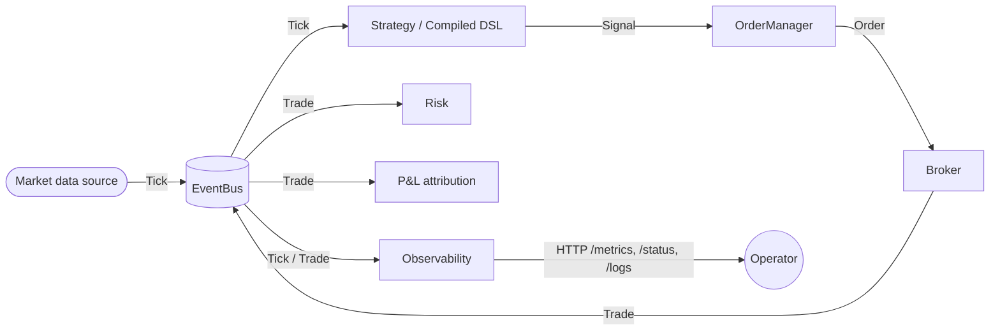
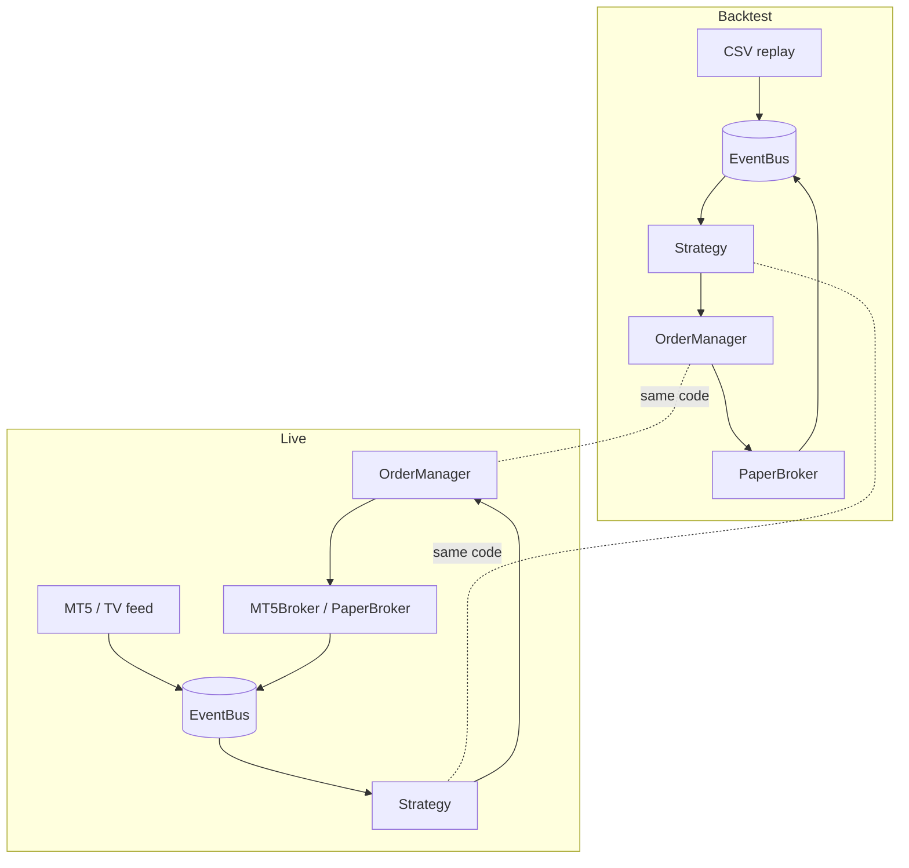
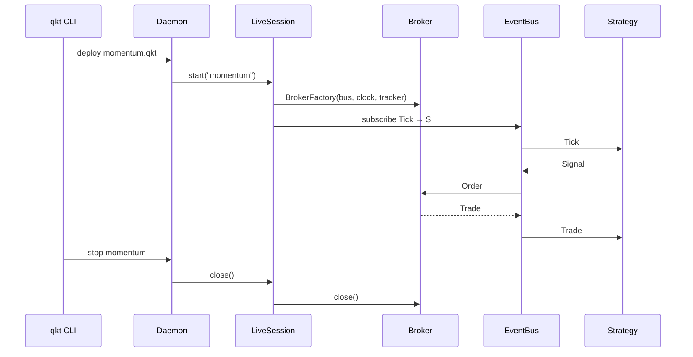
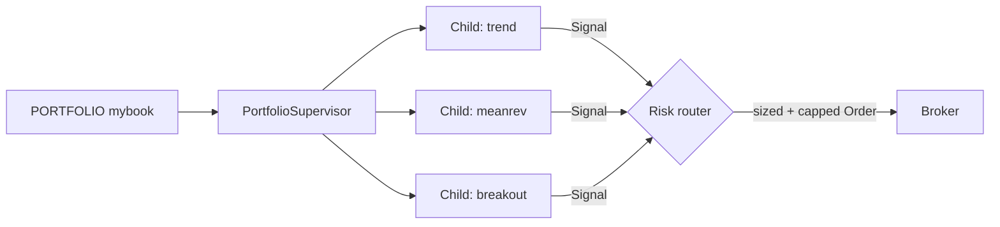

# Architecture

qkt is event-driven from end to end: market data flows in as ticks, strategies emit signals, signals become orders, orders go to a broker, fills come back, the engine settles them, and observers see the state.

## High-level topology

The `EventBus` is the single backbone. Components publish and subscribe; nobody calls anyone directly. This is what enables backtest=live parity: swap the source from a CSV replay to a live feed, swap the broker from `PaperBroker` to `MT5Broker`, and the same strategy code runs.

## Backtest vs live

Phase 19's parity test enforces that the same strategy + same tick stream produces the same trades regardless of which path runs them.

## Strategy lifecycle inside a daemon

Each `LiveSession` owns its broker. Stopping a strategy fully tears down its connection to the venue — no shared state across sessions.

## Portfolio dispatch (Phase 14)

A portfolio is a parent strategy that spawns children. Each child publishes signals scoped to its alias; the supervisor's risk router sizes and caps before forwarding to the broker.

## Where to read more

- [Determinism](determinism.md) — the parity contract and what's deterministic.
- [Backtest model](backtest-model.md) — how fills, slippage, and equity are computed.
- [Broker integration](broker-integration.md) — capability matrix and MT5 specifics.
- API reference (KDoc) — <a href="/qkt/api/">/api/</a> (built by CI)
- Phase changelogs — [Phases](../phases/index.md)
