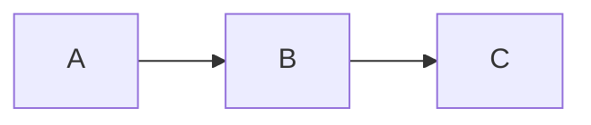

# Phase 21 — Documentation site

## Summary

Phase 21 turns the repo's accumulated specs, plans, and changelogs into a navigable public documentation site. MkDocs Material + Mermaid + Dokka, deployed to GitHub Pages by a workflow that runs on every `main` push touching docs, source, or build config. The information architecture follows the Diátaxis framework — separate sections for Get started / Tutorials / How-to / Reference / Concepts / Operations / Contributing / Phases — and the visual design lands on indigo primary with Inter + JetBrains Mono.

## What's new

- `mkdocs.yml` — Material theme, navigation tabs + sections + indexes, Mermaid via the `mermaid2` plugin, full pymdownx extensions stack (admonitions, tabbed, tasklist, details, snippets, superfences, highlight). `exclude_docs` for `superpowers/` + `phase4-backlog.md`; `not_in_nav` for `logging.md`, `memory-audit.md`, `release-process.md`.
- `requirements-docs.txt` — pinned `mkdocs==1.6.1`, `mkdocs-material==9.5.49`, `mkdocs-mermaid2-plugin==1.2.1`, `pymdown-extensions==10.12`.
- `docs/assets/extra.css` — custom palette overrides + `.grid.cards` styles for homepage feature tiles.
- Dokka 1.9.20 added to `gradle/libs.versions.toml` + `build.gradle.kts`. `./gradlew dokkaHtml` produces `build/dokka/html/`.
- `.github/workflows/docs.yml` — Build job: JDK 21 + Dokka, Python 3.12 + MkDocs strict, embed Dokka under `site/api/`, upload Pages artifact. Deploy job: `actions/deploy-pages@v4` with `pages: write, id-token: write`. Header comment documents the workflow-injection safety check (no untrusted template expressions).
- Site nav covers: Home, Get started (Quickstart, Deploy paper, Deploy MT5), Tutorials (stub), How-to (stub), Reference (DSL grammar, CLI, config), Concepts (Architecture, Determinism, Backtest model, Broker integration), Operations (Deploy with Docker, Logging), Contributing (Development setup, Conventions, Phase workflow), Phases (all changelogs), Backlog.
- Architecture page (`concepts/architecture.md`) ships four Mermaid diagrams: high-level topology, backtest-vs-live parity, strategy lifecycle inside a daemon, portfolio dispatch.
- Homepage (`docs/index.md`) hides navigation/toc, leads with four feature cards (Quickstart, Determinism, Reference, Deploy MT5).

## Migration from previous phase

No code surface change beyond the version bump. Existing `docs/` files are preserved — Phase 21 only added new content and config:

```yaml
# build.gradle.kts gains:
alias(libs.plugins.dokka)

tasks.named<org.jetbrains.dokka.gradle.DokkaTask>("dokkaHtml") {
    moduleName.set("qkt")
    outputDirectory.set(layout.buildDirectory.dir("dokka/html"))
}
```

```toml
# gradle/libs.versions.toml gains:
dokka = "1.9.20"
[plugins]
dokka = { id = "org.jetbrains.dokka", version.ref = "dokka" }
```

```text
# .gitignore gains:
site/
.cache/
.venv-docs/
```

## Usage cookbook

### Preview the site locally

```bash
python3 -m venv .venv-docs
source .venv-docs/bin/activate
pip install -r requirements-docs.txt
mkdocs serve              # http://localhost:8000
```

### Full local build (mirrors CI)

```bash
./gradlew dokkaHtml
mkdocs build --strict
mkdir -p site/api && cp -r build/dokka/html/. site/api/
```

### Add a new doc page

1. Create `docs/<section>/<name>.md`.
2. Add a nav entry in `mkdocs.yml` (or leave it unlisted under `not_in_nav` for utility pages).
3. Cross-link from related pages.
4. `mkdocs build --strict` must exit 0.

### Add a Mermaid diagram

````markdown

````

The `mermaid2` plugin handles rendering — no manual script tags needed.

### Trigger a deploy

The `docs` workflow runs on push to `main` when any of `docs/**`, `mkdocs.yml`, `requirements-docs.txt`, `src/main/**`, `build.gradle.kts`, `gradle/libs.versions.toml`, or `.github/workflows/docs.yml` changes. It also accepts `workflow_dispatch` for manual runs.

## Testing patterns

The site is verified by:

- **`mkdocs build --strict`** — exits non-zero on any broken link, missing nav entry, or markdown error. Run before pushing.
- **`./gradlew dokkaHtml`** — verifies KDoc compiles cleanly.
- The CI workflow combines both, so a green CI run is the production gate.

There is no test framework for the site content itself; broken links are caught by strict mode, broken Mermaid by the plugin, broken Dokka by the Gradle task.

## Known limitations

- Tutorials and How-to sections are stubs. Walkthrough content (build a momentum strategy end-to-end, debug a live deploy) is deferred — backlog items.
- Operations section covers Docker + logging; still missing pages for monitoring, alerting, upgrade, troubleshooting, capacity. These are stubbed in the index and tracked in backlog.
- No search analytics. Algolia DocSearch is the only paid path; we use built-in MkDocs search instead.
- API reference (Dokka) is built only by CI. Local builds get a `/api/` link pointing to the published site.

## References

- Site (post-deploy): https://elitekaycy.github.io/qkt/
- Spec: [`docs/superpowers/specs/2026-05-10-documentation-plan-design.md`](../superpowers/specs/2026-05-10-documentation-plan-design.md) (excluded from built site, in repo)
- Phase plan: tracked inline via TaskCreate, not as a separate plan file (skipped per "execute directly" preference for this phase)
- Mermaid + MkDocs Material: https://squidfunk.github.io/mkdocs-material/
- Diátaxis: https://diataxis.fr/
