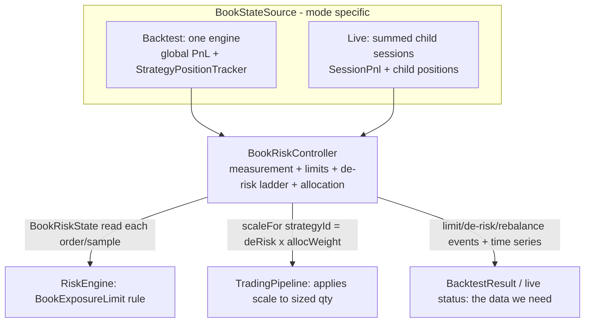

# Portfolio Book-Risk Layer — Design Spec

**Status:** approved (brainstorm 2026-06-19; "do recommended for all", build to institutional-tradeable).
**Goal:** make a qkt portfolio a *book-as-risk-object* — the account/book is the primary risk and capital unit, with the controls a multi-strategy desk runs: cross-strategy risk **measurement**, book **exposure limits**, graduated **drawdown de-risking**, and dynamic **capital allocation** (volatility targeting + equal-risk-contribution). Every control is modeled identically in backtest and live (Backtest=Live), so a rule can be validated on history before it gates real money.

**Non-goals (YAGNI, deferred):** intraday VaR/ES and parametric tail models; Barra-style factor decomposition; hierarchical risk parity (HRP); transaction-cost-aware rebalancing optimizer; live rolled-up portfolio `/status` UI (separate follow-up). These are namable extension points, not built now.

---

## 1. What exists today (the seams we extend)

- **`TradingPipeline`** — constructed identically by `Backtest`/`ReplayEngine` and `LiveSession` (the parity boundary). Strategy signal → sizing → `OrderRequest` → `RiskEngine.approve` → broker. **This is the one place a sizing scale applies to both paths at once.**
- **`RiskEngine.approve(request)`** — per-order gate running `RiskRule`s; already lets **risk-reducing** orders (`isRiskReducing`) through a halt. Book limits become one more `RiskRule`.
- **`RiskState` / `HaltRule`** — running per-account + per-strategy equity/drawdown/daily-PnL trackers; `HaltDecision.Halt(reason, strategyId?, scope=DAILY|PERSISTENT)`.
- **`PortfolioRiskAggregator` + `BookPnLProvider` + `ChildRiskTarget{flatten,halt,resume}`** — the live-daemon book layer. Today: **binary** flatten-and-halt-all on a book-DD breach; **live-only** (runs on `PortfolioSupervisor`, absent from backtest).
- **Phase A analytics** (`BookReturnCollector` → `BookAnalytics`): online cross-strategy return correlation, contribution-to-return, risk contribution (PCTR), drawdown contribution. **Reused as the covariance/measurement core.**

**Two structural facts that shape everything:**
1. The same `TradingPipeline` runs in both modes → applying a per-strategy **book scale factor** there is parity-safe by construction.
2. In **backtest** a portfolio must run as **N attributed strategies on one engine** (distinct `strategyId`s, shared account) — the same structure live presents as N fan-out sessions. The book layer then sees an identical N-strategy book in both. (Today `qkt backtest <portfolio>` wraps children as a single `PortfolioStrategy`; §6 fixes that.)

---

## 2. Architecture — the shared seam (Approach A1)

One deterministic component, `BookRiskController`, is the brain. It is fed aggregated book state through a `BookStateSource` (mode-specific) and consulted at two points that are **already shared or per-session in both modes**:



- **`BookRiskController`** (new, `com.qkt.risk.book`) — holds `BookRiskConfig`, rolling stats (reuses `BookReturnCollector` for covariance; adds exposure + vol), and the book drawdown window. On each sample it refreshes a `BookRiskState`. Deterministic: identical inputs → identical outputs.
- **`BookStateSource`** (interface) — `fun sample(timestampMs: Long): BookSnapshot`. Impls: `EngineBookStateSource` (backtest: global `PnLProvider` + `StrategyPositionTracker` + `MarketPriceTracker` + `InstrumentRegistry`) and `SessionsBookStateSource` (live: sums children's `SessionPnl` + positions). Same `BookSnapshot` shape from both.
- **`BookRiskState`** (immutable snapshot, read by gate + pipeline) — `deRiskFactor: BigDecimal` (0–1), `allocationWeight(strategyId): BigDecimal`, and limit query `wouldBreach(symbol, side, addedNotional): LimitVerdict`. `scaleFor(strategyId) = deRiskFactor * allocationWeight(strategyId)`.
- **Wiring:** `BookRiskController` is injected (nullable) into `TradingPipeline` (sizing scale) and `RiskEngine` (the `BookExposureLimit` rule). **Null controller = today's behavior exactly** — so the whole layer is config-gated and parity-neutral when off.

**Live thread-safety:** the controller is a single shared instance across all child sessions; updated on every child fill (via the bus / `RiskState.onFill` hook) and read on every child order. State reads/writes are atomic snapshots (`@Volatile` reference swap of the immutable `BookRiskState`, like `RiskState`'s halt flags). Backtest is single-threaded so this is trivially correct there.

---

## 3. F — Book risk measurement (foundation)

`BookSnapshot` (computed per cadence sample — TICK/CANDLE_CLOSE/FILL, same cadence as `EquityCurveCollector`):

```kotlin
data class BookSnapshot(
    val timestampMs: Long,
    val bookEquity: BigDecimal,          // capital + Σ child realized + Σ child unrealized
    val bookPeakEquity: BigDecimal,      // running peak (for DD)
    val grossExposure: BigDecimal,       // Σ over strategies,symbols |qty * price * contractSize|
    val netExposure: BigDecimal,         // |Σ signed notional|, netted per symbol then summed abs
    val perSymbolNetNotional: Map<String, BigDecimal>,
    val perStrategyPnl: Map<String, BigDecimal>,   // for return series → covariance
)
```

- **Exposure** closes the Phase-A-deferred gross/net exposure gap. Needs per-strategy position notional: `qty * price(symbol) * contractSize(symbol)`. `EngineBookStateSource` reads `StrategyPositionTracker` + `MarketPriceTracker` + `InstrumentRegistry` (all present in `ReplayEngine`).
- **Book vol** — annualized stdev of book returns; reuse `SharpeAccumulator`-style online variance over the book-return series (constant capital base, as Phase A).
- **Covariance / correlation** — reuse `BookReturnCollector`'s online pairwise sums (`sumCross`, `sumR`, `sumR2`); expose a `covarianceMatrix(): Map<Pair, BigDecimal>` and per-strategy variance for ERC.
- **Drawdown** — book peak-to-trough on `bookEquity` (the de-risk ladder's input).

Reporting (the "exact data we need"): a `BookRiskReport` carried on `BacktestResult` — decimated time series of `{grossExposure, netExposure, bookVol, deRiskFactor, allocationWeights}` + an event log `{limit breaches, de-risk rung changes, rebalances}`. Serialized in `--json` (`bookRisk`) and the `--report` bundle (`book_risk.csv` + events). Live: same numbers on the rolled-up status (follow-up surface; data computed now).

---

## 4. S1 — Book exposure limits

Config (`book_risk.limits`): `maxGrossExposure` (× book capital, e.g. 3.0), `maxNetExposure` (× capital), `maxSymbolConcentration` (× capital, per symbol). All optional; unset = no cap.

`BookExposureLimit : RiskRule` — on each order, compute the order's added notional; if the order is **risk-increasing** and would push gross/net/per-symbol past a cap, `Decision.Reject("book gross-exposure cap …")`. **Risk-reducing orders always pass** (reuse `isRiskReducing`). Reads the live `BookRiskState` (book exposure as of the last sample) + the candidate order. Added to the `RiskEngine` rule list in both backtest (engine) and live (each child session) — same rule, same inputs → parity. Limit breaches are recorded as events.

---

## 5. S2 — Graduated drawdown de-risking

Generalizes the binary aggregator into a ladder. Config (`book_risk.de_risk.ladder`): ordered rungs `[{drawdown: 0.02, factor: 0.80}, {drawdown: 0.04, factor: 0.40}, {drawdown: 0.06, factor: 0.0, cooldownBars: N}]`.

- The controller maps current book DD → `deRiskFactor` (the factor of the deepest rung whose threshold is breached; 1.0 above the first rung). Hysteresis: a rung only relaxes after DD recovers past the rung below it (avoid flapping); the `factor: 0.0` rung holds for `cooldownBars` after DD recovers.
- **Application:** `TradingPipeline` multiplies every **risk-increasing** sized order by `deRiskFactor`. `factor 0` ⇒ no new exposure (existing positions/exits untouched — `isRiskReducing` still flows). This *is* the binary aggregator's flatten+halt as the bottom rung, but graduated above it.
- The existing live `PortfolioRiskAggregator` is refactored to drive its `flatten/halt` from the controller's bottom rung, so live and backtest share the ladder logic (no parallel implementation).

---

## 6. S3 — Dynamic capital allocation (vol targeting + ERC)

Config (`book_risk.allocation`): `method: FIXED | INVERSE_VOL | ERC` (default `FIXED` = today's static `CAPITAL×WEIGHT`), `targetVol` (annualized, optional — enables vol scaling), `rebalance: {everyBars: N}` (deterministic cadence), `covLookbackBars`.

- On each rebalance boundary the controller recomputes per-strategy weights from the rolling covariance matrix:
  - **INVERSE_VOL:** `w_i ∝ 1/σ_i`.
  - **ERC (risk parity):** solve for weights so each strategy's risk contribution `RC_i = w_i·(Σw)_i / (w'Σw)` is equal — standard cyclical-coordinate-descent / fixed-point iteration on the covariance matrix (bounded iterations, deterministic). Falls back to inverse-vol if the matrix is degenerate (e.g. < lookback samples).
- **Vol targeting:** scale the whole weight vector so the book's predicted vol `√(w'Σw)·√annualization` equals `targetVol` (cap the scale at a configurable max leverage).
- **Application:** weights flow as `allocationWeight(strategyId)`; `TradingPipeline` multiplies sized orders by it (combined with the de-risk factor). The static PORTFOLIO `WEIGHT` becomes the initial/prior weight; dynamic allocation moves it on cadence. Between rebalances weights are constant ⇒ deterministic.
- **Parity:** weights are a pure function of the covariance accumulated to the rebalance timestamp; backtest and live align on the same cadence/inputs ⇒ identical weights. Rebalances are logged as events.

---

## 7. Parity strategy (the keystone)

- The book scale (`deRiskFactor × allocationWeight`) is applied in the **shared `TradingPipeline`**; the limit is a **shared `RiskRule`**. Identical code in both modes.
- `BookStateSource` is the *only* mode-specific piece; it produces an identical `BookSnapshot` contract. Backtest: deterministic single-threaded aggregation. Live: summed child snapshots at the same cadence.
- **New `BookRiskParityTest`** (alongside `BacktestLiveParityTest`): a 2-strategy book with all controls enabled, run as backtest vs `LiveSession`+`PaperBroker`, asserting byte-identical trades — proving the controller fires identically.
- **Default-off:** every control is config-gated; a null/empty `book_risk` config yields a null controller and today's exact behavior. Existing `SweepReplayParityTest`/`BacktestLiveParityTest` stay green unchanged.

---

## 8. Portfolio-in-backtest unification (§1 fact 2)

`qkt backtest <portfolio.qkt>` must run children as **N attributed strategies on one engine** (not one wrapped `PortfolioStrategy`), so per-strategy attribution, Phase-A analytics, and the book controller all see the live structure. `BacktestContext`/`Backtest` learns to load a `PortfolioFile`: compile each child to its own `(strategyId, Strategy)` with `strategyId = "<portfolio>:<alias>"`, seed per-child starting balance from `CAPITAL×WEIGHT`, and construct the `BookRiskController` from `book_risk` config. The regime-gate `WHEN … RUN` semantics are preserved by wrapping each gated child in a thin gate (or carrying the gate into the engine) — chosen during planning to keep gate behavior identical to the live `PortfolioStrategy`.

---

## 9. Configuration surface

`qkt.config.yaml` (already loaded by both backtest `BacktestContext` and the live daemon — parity-consistent), new optional section:

```yaml
book_risk:
  capital: "100000"            # book basis; defaults to backtest starting-balance / portfolio CAPITAL
  limits:
    max_gross_exposure: "3.0"  # x capital
    max_net_exposure: "1.5"
    max_symbol_concentration: "1.0"
  de_risk:
    ladder:
      - { drawdown: "0.04", factor: "0.5" }
      - { drawdown: "0.08", factor: "0.0", cooldown_bars: 390 }
  allocation:
    method: "ERC"              # FIXED | INVERSE_VOL | ERC
    target_vol: "0.10"         # annualized; omit to disable vol scaling
    rebalance_every_bars: 390
    cov_lookback_bars: 5850
    max_leverage: "4.0"
```

`Config` gains a typed `bookRisk: BookRiskConfig?`. Absent ⇒ layer off. (A PORTFOLIO-file `RISK {}` DSL block is a deferred nicety; config.yaml ships first because both paths already read it.)

---

## 10. Build order (each piece independently shippable, default-off)

- **F (foundation):** `BookStateSource` + `BookSnapshot` + exposure/vol measurement + `BookRiskReport` plumbing + reporting. Closes Phase-A exposure gap. PR 1.
- **§8 unification:** portfolio backtest runs N attributed strategies. PR 2 (can merge with F).
- **S1 limits:** `BookExposureLimit` rule + config + events. PR 3.
- **S2 de-risking:** ladder + `TradingPipeline` scale + refactor live aggregator onto it. PR 4.
- **S3 allocation:** INVERSE_VOL then ERC + vol targeting + rebalance cadence. PR 5.
- Each PR: parity gate green, default-off verified, new behavior tested, ktlint clean.

## 11. Institutional-ready checklist (definition of done)

- [ ] Book gross/net/concentration limits enforced pre-trade, risk-reducing always allowed.
- [ ] Graduated DD de-risking (ladder + cooldown + hysteresis), live aggregator unified onto it.
- [ ] Dynamic allocation: ERC + vol targeting + inverse-vol, deterministic rebalance cadence, max-leverage cap.
- [ ] Cross-strategy measurement: gross/net exposure, book vol, covariance/correlation, contribution + risk contribution.
- [ ] All controls modeled in **backtest and live**; `BookRiskParityTest` byte-identical.
- [ ] Audit trail: limit/de-risk/rebalance events + time series in `--json` and `--report` (the data we need).
- [ ] Default-off; existing parity tests unchanged.
- [ ] Validated end-to-end on the SSH bot's historical data: a multi-strategy portfolio backtest runs clean and emits the full book-risk dataset.

## 12. Testing strategy

- Unit: exposure math, de-risk ladder (rung selection + hysteresis + cooldown), ERC solver (known-covariance fixtures → equal risk contributions), vol-target scaling, inverse-vol.
- Integration: 2–3 strategy backtest with each control; assert limits reject the right orders, de-risk scales sizes at DD thresholds, weights move on rebalance, report carries the series/events.
- Parity: `BookRiskParityTest` (backtest == live+paper, all controls on).
- Regression: existing `SweepReplayParity`/`BacktestLiveParity` green with layer off.
- E2E: run on SSH-bot data (real instruments.yaml + cached ticks), confirm clean run + complete dataset.
